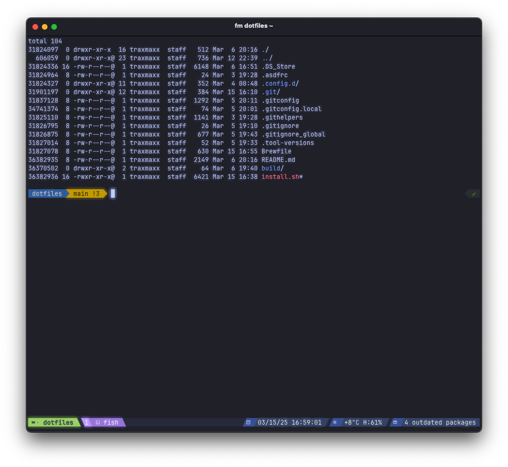

# Dotfiles

A collection of configuration files for setting up my development environment.



## Requirements

- macOS or Linux
- [Homebrew on macOS](https://brew.sh/)
- [GNU Stow](https://www.gnu.org/software/stow/)
- Bash shell (for running the installation script)

## Installation

Run the following commands to clone the repo and create proper symlinks:

```bash
git clone https://github.com/username/dotfiles.git ~/dotfiles
cd ~/dotfiles
stow .
```

### How It Works

My dotfiles setup reates directories and symlinks files inside `~/` via [GNU Stow](https://www.gnu.org/software/stow/). The main packages and Homebrew are being installed via the `install.sh` script

### Full Installation

To perform a full installation, which will:
- Install required packages
- Create necessary directories and symlink all configuration files
- Set up fish as your default shell

Simply run:

```bash
./install.sh
stow .
```

### Updating Existing Configuration

To update symlinks for new files:

```bash
stow .
```

This will update the symlinks for all tracked files without removing any untracked files in your config directories.

## Structure

The repository follows this structure:

```
dotfiles/
├── .config/           # Configuration files that will be symlinked to ~/.config/
│   ├── fish/          # Fish shell configuration
│   ├── nvim/          # Neovim configuration
│   └── ...            # Other config directories
├── .gitignore_global  # System wide gitignore file
├── .githelpers        # Git helper functions
├── .asdfrc            # System wide ASDF configuration
├── .tool-versions     # System wide ASDF tool versions
├── .stow-local-ignore # List of files and directories Stow should ignore
├── .stowrc            # Default parameters for stow command when running it from the project root
├── Brewfile           # Brew packages to be installed
└── install.sh         # Installation script
```

## Customization

Feel free to modify any of the configuration files to suit your preferences. Just run `stow .` from the project root to symlink new files after making changes to the repository.
