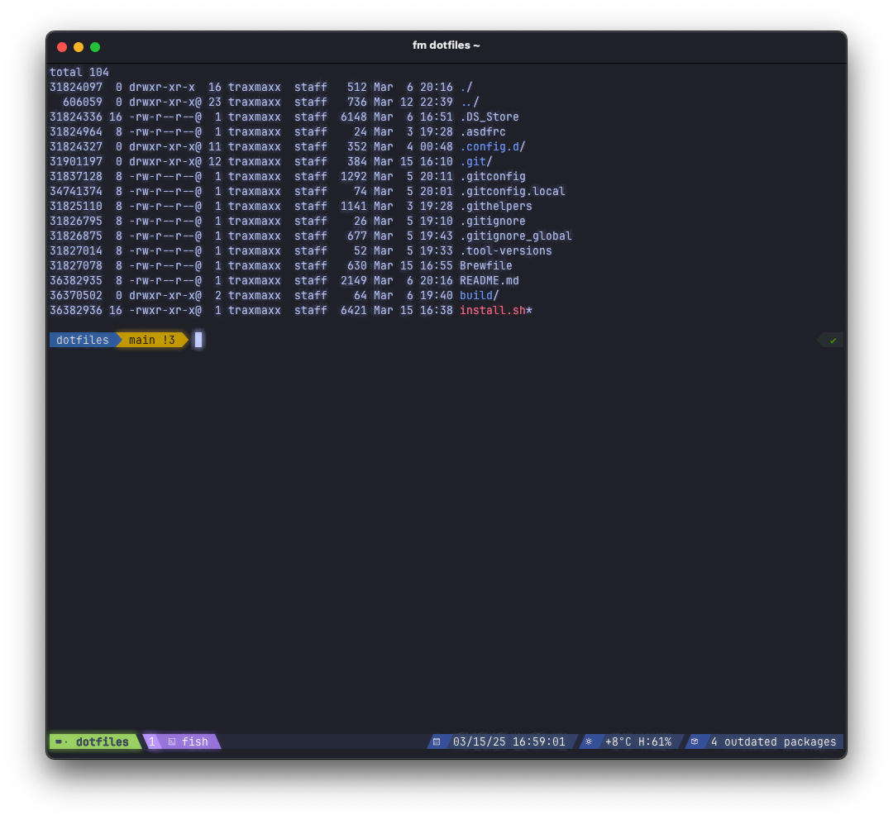

# Dotfiles

A collection of configuration files for setting up my development environment.



## Requirements

- macOS or Linux
- [Homebrew on macOS](https://brew.sh/)
- [GNU Stow](https://www.gnu.org/software/stow/)
- Bash shell (for running the installation script)

## Installation

Run the following commands to clone the repo and create proper symlinks:

```bash
git clone https://github.com/username/dotfiles.git ~/dotfiles
cd ~/dotfiles
stow .
```

### How It Works

My dotfiles setup reates directories and symlinks files inside `~/` via [GNU Stow](https://www.gnu.org/software/stow/). The main packages and Homebrew are being installed via the `install.sh` script

### Full Installation

To perform a full installation, which will:
- Install required packages
- Create necessary directories and symlink all configuration files
- Set up fish as your default shell

Simply run:

```bash
./install.sh
stow .
```

### Updating Existing Configuration

To update symlinks for new files:

```bash
stow .
```

This will update the symlinks for all tracked files without removing any untracked files in your config directories.

## Structure

The repository follows this structure:

```
dotfiles/
├── .config/                       # Configuration files symlinked to ~/.config/
│   ├── aerospace/                 # macOS window manager config
│   ├── firefox/                   # Firefox user preferences
│   ├── fish/                      # Fish shell config, completions, functions
│   ├── fontconfig/                # Font configuration
│   ├── ghostty/                   # Ghostty terminal emulator
│   ├── helix/                     # Helix editor config
│   ├── i3/                        # i3 window manager config (Linux)
│   ├── joplin-desktop/            # Joplin notes app styling
│   ├── kitty/                     # Kitty terminal emulator config
│   ├── nvim/                      # Neovim editor configuration
│   ├── opencode/                  # OpenCode AI agent configs
│   ├── tmux/                      # Tmux terminal multiplexer
│   └── zellij/                    # Zellij terminal multiplexer
├── Library/                       # macOS application configs (Sublime Text)
├── .asdfrc                        # ASDF version manager config
├── .ideavimrc                     # IntelliJ IDEA Vim mode config
├── .spacemacs                     # Spacemacs editor config
├── .stow-local-ignore             # Files ignored by GNU Stow
├── .stowrc                        # Stow command defaults
├── .tool-versions                 # ASDF tool version specifications
├── Brewfile                       # Homebrew package list
├── install.sh                     # Full installation script
└── screenshots/                    # Documentation screenshots
```

## Customization

Feel free to modify any of the configuration files to suit your preferences. Just run `stow .` from the project root to symlink new files after making changes to the repository.
